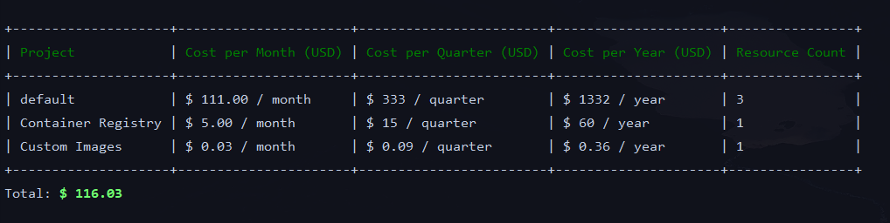

## About DigitalOcean Pricer

DigitalOcean pricer is a tool used to gain insight into the various costs associated with your infrastructure!

### Installing
First, install this package globally on your system...

`composer global require uthereal/digitalocean-pricer`

Second, make sure you have added composer's `bin` path to your system's `GLOBAL` path...

`https://gprivate.com/5z8q5`

### Running
`php do-pricer monthly-cost [DROPLET TOKEN]`

